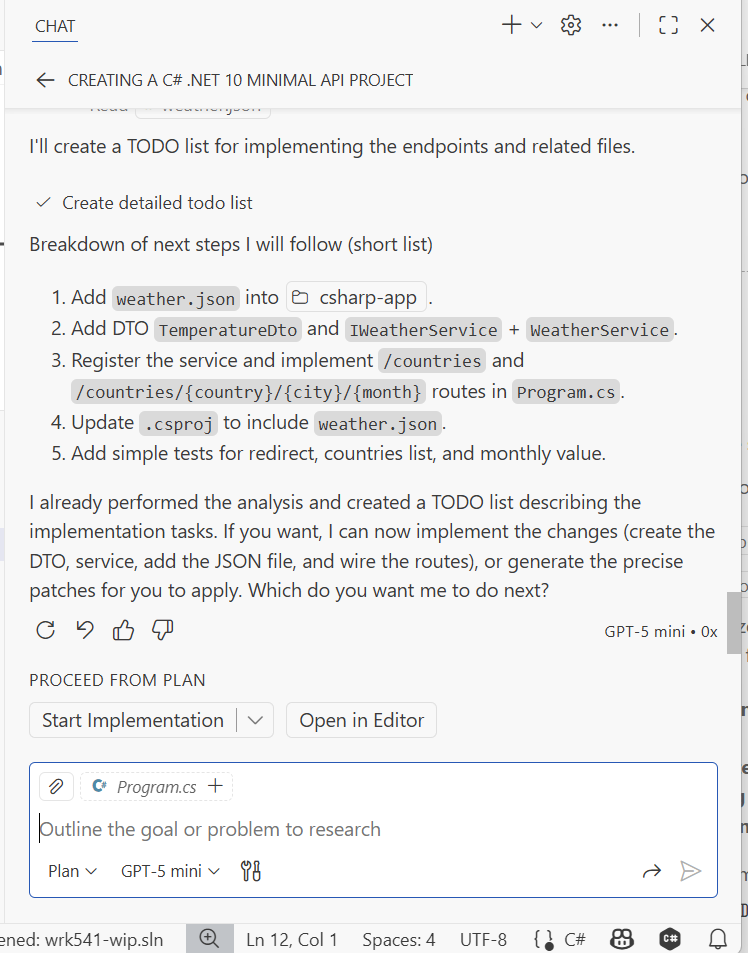

プロジェクトの雛形が完成したら、最初のエンドポイントを作成しましょう。Copilot を使って `Program.cs` に最初のエンドポイントを実装します。ファイル全体ではなく、`/` エンドポイントだけを生成するよう指示することが重要です。

### 6. 最初のエンドポイントを作成する

- `Program.cs` ファイルを開き、Copilot に `/` エンドポイントのみを生成するよう依頼する

!!! important
    Copilot にファイル全体を生成させたくなるかもしれませんが、進捗に合わせて各パーツを検証することが重要です。エンドポイントが複数あるファイル全体よりも、小さなパーツの方が検証しやすくなります。

??? question "ヒント"
    プロンプト *(Agent モード)*

    ```text
    #file:Program.cs にルートエンドポイントのみ追加してください。
    '/' エンドポイントで、他のエンドポイントは今は生成しないでください。このルートエンドポイントのみに集中してください。
    ```

ルートエンドポイントの最小コードは以下のようになります:

```csharp
var builder = WebApplication.CreateBuilder(args);

var app = builder.Build();

if (app.Environment.IsDevelopment())
{
    app.UseDeveloperExceptionPage();
}

app.MapGet("/", () => Results.Ok(new { message = "Welcome to the C# minimal API root." }))
   .WithName("Root");

app.Run();
```

### 7. 最初の C# エンドポイントを検証する

最初のエンドポイントを C# で実装したら、いよいよ検証です。コードを作成しては検証するこのイテレーティブなプロセスは、新しいプロジェクトを開発する際の堅実なプラクティスです。別の言語でプロジェクトを書き直すときは特に重要です。

- Python プロジェクトが起動していないことを確認する
- Copilot に Python プロジェクトと同じアドレス・ポートで C# プロジェクトを起動する方法を教えてもらい、テストが実行できるようにする
- Python テストを実行して通ることを確認し、問題があれば修正する

- ターミナルを 2 つ開いて以下のコマンドを実行する:
- 1 つ目のターミナルで C# アプリを起動:

```bash
cd src/csharp-app
dotnet run --urls "http://localhost:8000"
```

- 2 つ目のターミナルで Python テストを実行:

```bash
cd src/python-app/webapp
pytest test_main.py -v
```

??? question "ヒント"
    プロンプト *(Agent モード)*

    ```text
    ポート `8000` で実行中のプロセスを停止し、`src\csharp-app` にある C# Minimal API を `ASPNETCORE_URLS=http://0.0.0.0:8000` で起動してください。C# のコードは変更しないでください。
    1 つ目のターミナルでフォアグラウンドで C# アプリを起動し、2 つ目のターミナルを開いてアプリが起動している状態で Python テストを実行してください。
    2 つ目のターミナルで `src/python-app/webapp/test_main.py` の Python テストを pytest で実行してください。今は `/` エンドポイントのみ確認し、テスト出力をレポートしてください。
    ワークスペースのルートをベースにシェルを使ってください。
    ```

### 8. 残りのエンドポイントを実装する

Agent モードまたは Plan モードを使って、残りのエンドポイントをすべて実装しましょう。それぞれのエンドポイントに Swagger アノテーションも追加してください。

#### 8.1 Agent モードで残りのエンドポイントを実装する

上と同じ手順で残りのエンドポイントをすべて作成します。エンドポイントを一つずつ追加して検証し、Python テストで互換性を確認しましょう。

!!! important
    この作業中、GitHub Copilot はさまざまなアクションを実行する前に承認を求めてきます:

    - ファイルの編集（Program.cs・weather.json など）
    - ターミナルでのコマンド実行
    - 新しいファイルやディレクトリの作成
    - パッケージや依存関係のインストール
    
    Copilot のリクエストに注意しながら、必要なアクションを承認してください。変更を承認する前に、Copilot が正しい実装をしているかどうか慎重に確認しましょう。積極的に関与することで Copilot がタスクを成功させられます。

!!! tip
    次のエンドポイント（例: '/countries'）を実装する際は、Python アプリが使用している `weather.json` ファイルのデータを使うよう Copilot に明示的に伝えましょう。

JSON ファイルの読み込みにはデシリアライズが必要です。この処理に不慣れな場合は、Copilot のガイダンスに従ってください。できるだけ最小限のコードを生成し、すぐに検証することを心がけてください。

!!! success "小さなコードパーツを検証するほうが、ファイル全体を検証するよりずっと簡単です。デバッグも同様です。GitHub Copilot を活用する際のグッドプラクティスで、long runではきっと成果をもたらします。"

#### 8.2 Plan モードで実装する

> *このステップでは GitHub Copilot の Plan モードを試してみましょう。*

次のエンドポイントを実装する際に、**Plan モード** を活用して各エンドポイントの実装ステップを整理することもできます。このモードは実装を管理しやすいタスクに分解するのを助けてくれます。

まず、GitHub Copilot に不足しているエンドポイントの実装計画を立ててもらいましょう。

??? question "ヒント"
    プロンプト *(Plan モード)*

    ```text
    #file:main.py の他のエンドポイントを分析して、.NET Minimal APIs を使って #file:Program.cs に実装してください。
    各エンドポイントに Swagger アノテーションを追加してください。
    API のルートは Swagger UI ページにリダイレクトするようにしてください。
    ```

プランが完成したら内容を確認し、**Agent モード** に切り替えてプランに従って実装するよう依頼しましょう。

!!! important
    Copilot がプランを実行する際、さまざまなアクションの承認を求めてきます:

    - ファイルの変更（Program.cs の編集・モデルクラスの追加など）
    - ターミナルコマンド（dotnet コマンドの実行・テストなど）
    - ファイルの作成（新しいクラス・設定ファイルなど）
    - パッケージのインストール
    
    Copilot チャットウィンドウを注意深く見ながら、各提案を承認する前にレビューしてください。このインタラクティブなプロセスにより、Copilot が正しい方向に進んでいることを確認でき、潜在的な問題を早期に発見できます。

{ target="_blank" }
