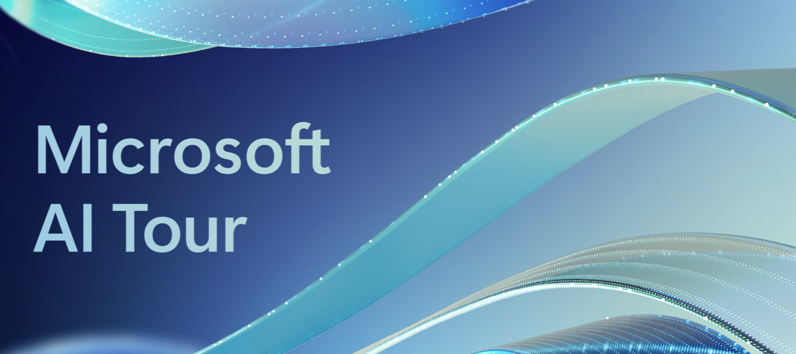
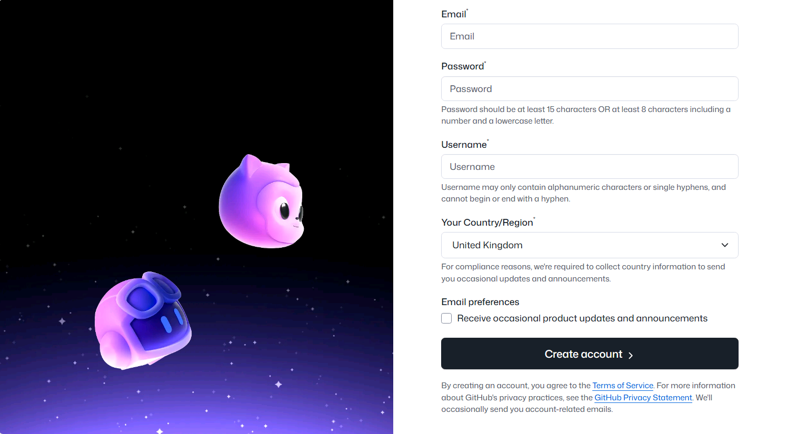

# WRK541 - GitHub Copilot エージェントモードを使ったリアルなコード移行

### 異なるプログラミング言語へのチャレンジングな移行を体験

- **対象者**：GitHub Copilot を活用した AI ペアプログラミングで、プログラミング言語間の移行・変換などの難しい作業を実践したいすべての技術者
- **学習内容**：プログラミング言語の変換プロジェクトで特に役立つ高度な GitHub Copilot テクニックと、Copilot が提供するさまざまなモードの活用方法
- **制作物**：Python で書かれた HTTP API を C#（.NET Minimal APIs）へ移行したもの。元の Python API との完全な互換性で、季節ごとの気象データを取得できる HTTP API

## 学習目標

このワークショップでは、以下を学びます：

- GitHub Copilot の各モードの違い、使い分け、ベストプラクティス、最大活用のためのツール
- Web 開発における Python と C# の違いを理解する
- Python の FastAPI から C# の ASP.NET Core Minimal APIs に移行する際の、構文・ライブラリ・フレームワークの主要な違いを学ぶ
- C# における JSON のシリアライズ・デシリアライズを実装する
- `System.Text.Json` を使って JSON データを処理する実践的な経験を積み、元の Python API との互換性を確保する
- C# でエンドポイントを段階的に開発・検証する
- 個々のエンドポイントを反復的に作成・テストし、元の Python API との一致を確認する練習をする
- Swagger/OpenAPI ドキュメントを統合する：Swashbuckle と ASP.NET Core の OpenAPI サポートを使って包括的な API ドキュメントを追加する方法を学ぶ

## 📣 前提条件

このワークショップに参加するための前提条件は 1 つだけです。自分自身の GitHub アカウントを持っていることです。すべてのリソース、依存関係、データはリポジトリ自体に含まれています。GitHub Copilot のライセンス、トライアル、または無料版を用意してください。

### ✅ 開始前チェックリスト

ワークショップを始める前に、以下の準備ができているか確認してください：

- [ ] **GitHub アカウント**：作成済みでログインできる状態
- [ ] **GitHub Copilot へのアクセス**：GitHub Copilot が有効になっている（有料サブスクリプション、トライアル、または無料版）
- [ ] **環境の選択**：以下のどちらかを決めておく：
  - ☁️ **GitHub Codespaces**（推奨 - セットアップ不要）
  - 💻 **ローカル開発環境**（Python 3.12、.NET 10 SDK、VS Code が必要。詳細は [Resources.md](./resources.md) を参照）
- [ ] **ローカルセットアップの場合**：すべての前提条件がインストール・確認されている

!!! tip "どちらの環境を選ぶか迷っている場合は？"
    このワークショップでは GitHub Codespaces を推奨しています。すべてのツールがあらかじめ設定された環境が提供されるため、インストール不要で始められます！

### GitHub アカウントの作成

GitHub アカウントをお持ちでない場合は、以下の手順に従って無料で作成できます。

1. [GitHub のサインアップページ](https://github.com/join)にアクセスします。
2. メールアドレスを入力し、パスワードを作成して、ユーザー名を選択します。登録プロセスを簡単にするため、職場のメールアドレスより*個人のメールアドレス*の使用をお勧めします。
3. 国・地域を選択し、利用規約に同意します。
4. **「アカウントを作成する」** ボタンをクリックし、メールボックスに確認メールが届くのを待ちます。

    

5. メールに記載された確認コードをコピーして、GitHub ウェブサイトの確認フィールドに貼り付けます。次に **「続行」** をクリックします。
6. 以上で完了です！これで準備が整いました。

右下の **「ワークショップのナビゲーション」** と書かれた *「次へ」ボタン* をクリックして始めましょう。
