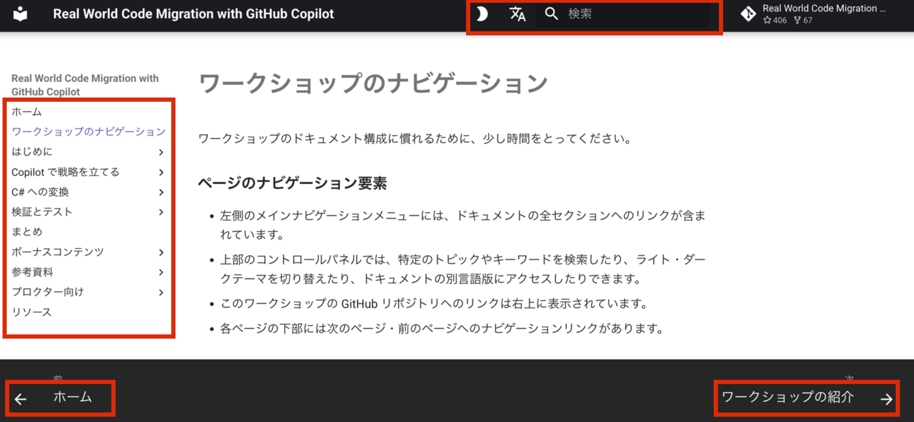

ワークショップのドキュメント構成に慣れるために、少し時間をとってください。

### ページのナビゲーション要素

- 左側のメインナビゲーションメニューには、ドキュメントの全セクションへのリンクが含まれています。
- 上部のコントロールパネルでは、特定のトピックやキーワードを検索したり、ライト・ダークテーマを切り替えたり、ドキュメントの別言語版にアクセスしたりできます。
- このワークショップの GitHub リポジトリへのリンクは右上に表示されています。
- 各ページの下部には次のページ・前のページへのナビゲーションリンクがあります。

### 画像を拡大する

ドキュメント内の画像を大きいサイズで表示するには、画像をクリックしてください。新しいタブで開き、詳細を確認できます。

{ target="_blank" }

### コードをコピーする

ワークショップを最大限に活用するため、ドキュメントからコードをコピーする機会が多くあります。

コードブロックはドキュメント全体にわたってグレーのボックスでハイライトされています。コードブロックの右側にカーソルを合わせると表示されるコピーアイコンをクリックすることで、コードをコピーできます。

```text
# コードブロックの例
```

### ワークショップ全体で使われるノートの種類について

!!! tip "このようなヒントは、有用で素早いインサイトや提案を表示します。"

!!! Note
    ノートは、そのトピックに関する重要な情報をハイライトします

??? question "ヒント（クリックで展開）"
    これらのヒントはクリック可能で、先に進むための提案されたコード・プロンプトを提供します。

!!! warning
    警告は指示への補足で、進めていく中で望ましい結果を得るために注意が必要です。

!!! bug
    このようなバグは、依存関係や AI モデルとエージェントを使う際の非決定論的な性質など、計画通りに進まない可能性のある理由を説明します。
