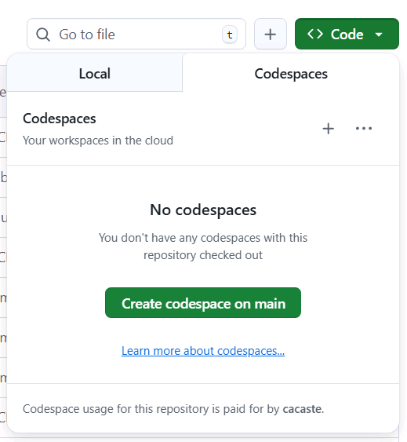
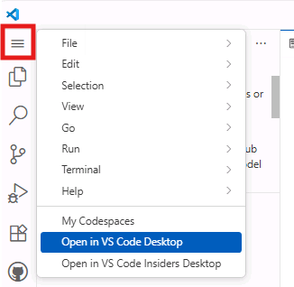

# リポジトリを開く（ローカルまたは GitHub Codespaces）

自分の作業環境に合ったワークフローを選択してください。ローカル開発環境で作業する場合、必要なツールはすべてインストール済みであることを前提としています（前提ツールの一覧は Resources ページを参照）。フルホスト型の環境を希望する場合は、GitHub Codespaces のパスに従ってください。

!!! note "イベント参加者の方へ"
    Microsoft のイベント会場（事前にプロビジョニングされたラボ環境が用意されている場合）に参加している場合でも、**ローカル環境** の手順に従って自分のマシンで作業することができます。ローカル環境の手順では、イベントのラボ環境の代わりに、必要な認証情報とリソースを自分のマシンでローカルに用意することを前提としています。ラボのリソースと認証情報については、イベントのガイダンスを参照してください。

=== "ローカル環境"

    1. リポジトリページを開きます: [Real World Code Migration with GitHub Copilot Agent Mode](https://github.com/microsoft/aitour26-WRK541-real-world-code-migration-with-github-copilot-agent-mode){:target="_blank"}
    
    1. リポジトリをマシン上の作業フォルダにクローンします:
    
        ```bash
        git clone https://github.com/microsoft/aitour26-WRK541-real-world-code-migration-with-github-copilot-agent-mode.git
        ```
    
    1. VS Code で **File > Open Folder** を選択し、クローンしたフォルダを開きます。
    
    1. VS Code で GitHub にサインインし、GitHub Copilot が有効になっていることを確認します（コマンドパレット → **GitHub: Sign in**）。
    
    1. Python プロジェクトの依存パッケージをインストールします:
    
        ```bash
        cd src/python-app
        ```
        
        ```bash
        pip install -r requirements.txt
        ```
    
    1. これでローカル環境でのワークショップを進める準備が整いました。ツールの一覧が必要な場合は、Resources ページの **ローカル環境の前提条件** セクションを参照してください。

=== "GitHub Codespaces"

    1. リポジトリにアクセスします: [Real World Code Migration with GitHub Copilot Agent Mode](https://github.com/microsoft/aitour26-WRK541-real-world-code-migration-with-github-copilot-agent-mode){:target="_blank"}
    2. GitHub アカウントにログインします。
    3. 右上の **Star** ボタンをクリックします（後で見つけやすくなります）。
    4. **<> Code** ボタンをクリックし、**Codespaces** タブを開いて **+** を選択し、新しい Codespace を作成します。
    
        
    
    5. ブラウザで Codespace のプロビジョニングが完了するまで待ちます。
    6. Codespace が起動すると、ブラウザ上で VS Code のような画面が表示されます。そのままブラウザで作業を続けるか、**Open in VS Code** をクリックしてデスクトップの VS Code から接続することもできます。
    
        

!!! success
    後でワークショップを再開したい場合は、GitHub のプロフィール画像をクリックして **Your stars** を選択してください。
