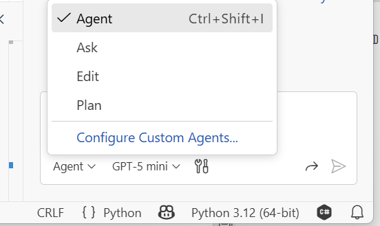
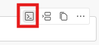

# プロジェクトを理解する

コードの移行を始める前に、まず対象プロジェクトをしっかり把握することが重要です。

## Python プロジェクトから始める

プロジェクトとその構造に慣れ親しみましょう。メインファイルは `main.py` で、`src` ディレクトリ配下の `python-app\webapp` フォルダに置かれています。このファイルにアプリケーションのメインロジックが実装されています。

### 1. プロジェクトを調べる

> このステップでは GitHub Copilot の Ask モードを使ってみましょう。

まず、Windows の場合は `Ctrl + Alt + I`、Mac の場合は `Command + Shift + I` を押して GitHub Copilot を開き、**Ask** モードになっていることを確認します:



!!! Note
    GitHub Copilot は LLM をベースにしているため、同じプロンプトでも毎回異なる回答が返ることがあります。このリポジトリで紹介しているプロンプトは **GPT-4.5-mini** モデルでテストされています。ドロップダウンからそのモデルを選ぶと同様の結果を得やすくなります。もちろん他のモデルも自由に試してみてください。


`#codebase` ツールを使って Copilot にコンテキストを提供し、このプロジェクトの概要を説明してもらいましょう。

- GitHub Copilot Chat を開き、プロンプトの先頭に `#codebase` を付ける
- プロジェクトの実行方法など、気になることを質問する

??? question "ヒント"

    プロンプト (Ask モード)

    ```text
    #codebase この Python プロジェクトが何をするものか詳しく教えてください
    ```

### 2. API エンドポイントを把握する

> *このステップでは GitHub Copilot の Ask モードを使ってみましょう。*

次に、プロジェクトを起動して Web アプリを実行します。`main.py` ファイルを開いた状態で GitHub Copilot Chat を使うか、`#main.py` でファイルを指定してエンドポイントについて質問しましょう。

!!! tip "Copilot の出力にターミナルコマンドが含まれている場合、右上のボタンをクリックするとそのままターミナルに貼り付けられます。"

- Web アプリの起動方法を質問する

??? question "ヒント"

    プロンプト (Ask モード)

    ```text
    #main.py この Python の Web アプリはどうやって起動すればいいですか？
    ```

- Copilot の提案をもとにプロジェクトを実際に起動してみる

!!! tip
    ターミナルを開いておく必要があります。FastAPI アプリを動かすには **uvicorn** が必要です。

!!! warning
    「Error loading ASGI app. Could not import module (...)」というエラーが出た場合は、Copilot の出力で提案されたパスが `main.py` の正しいファイルパスになっているか確認してください。
    正しいディレクトリにいることを確認してください: `src\python-app\webapp`

- アプリ起動時の出力に表示される URL から Swagger UI にアクセスし、利用可能なエンドポイントとリクエストの種類を確認する

!!! tip "テストに使用できるパラメータを確認するには [weather.json](https://github.com/microsoft/aitour26-WRK541-real-world-code-migration-with-github-copilot-agent-mode/blob/main/src/python-app/webapp/weather.json) ファイルを見てみましょう。"

### 3. Python テストを確認して実行する

> *このステップでは GitHub Copilot の Agent モードを使ってみましょう。*

`src/python-app/webapp/test_main.py` にテストファイルが用意されています。この Python テストファイルは FastAPI の TestClient を使って API エンドポイントを検証します。テストを実行して出力を確認しましょう。

アプリが起動している状態で、新しいターミナルを開いて pytest で Python テストを実行します:

```bash
cd src/python-app/webapp
pytest test_main.py -v
```

- テストが通らない場合は、GitHub Copilot を活用して問題を修正し、再度テストを実行する

!!! note
    これらのテストは HTTP リクエストを使用しているため、テスト実行前にアプリが起動していることが必要です。設定された BASE_URL（デフォルト: <http://localhost:8000>）でアプリが起動していない場合、テストは自動的にスキップされます。

    同じテストを C# Web アプリの検証にも使います。その際は BASE_URL 環境変数を C# アプリのポートに合わせて設定します（例: Windows では `$env:BASE_URL="http://localhost:5000"`、Linux/Mac では `export BASE_URL="http://localhost:5000"`）。
